---

# *Cinnova*

The Cinnova website allows people to learn what services the company provides.

The site can be accessed by this [link]()

---
## User Stories

### First Time Visitor Goals:

* As a First Time Visitor, I want to understand what kind of company it is and which services are provided.
* As a First Time Visitor, I want to be able to navigate easily through the website.

### Returning VisitorGoals:

* As a Returning Visitor, I want to see which services are provided.
* As a Returning Visitor, I want to find a way to get in contact with the company.
* As a Returning Visitor, I want to find social media links, so that I can learn more about the organization.

### Frequent Visitor Goals:
* As a Frequent User, I want to easily see if the company can help me with my issues or needs.
* As a Frequent User, I want easily to contact the company so they can provide a service for me.

## Features

+ ### Navbar

+ ##### Navigation
    - Navigation-bar is at the top of the page.
    - Contains company-logo of the company on the left side.
    - Contains navigation links on the right side:
        * HOME - this leads to the home page where users can learn about the company and get a preview of the services.
        * SERVICES - this leads to the services page where people can see more detailed information about the services provided.
        * CONTACT US - this leads to the contact page where there is information about the address of the company and a form to fill out if you want the company to contact you.
    - The links switch color when hovered.
    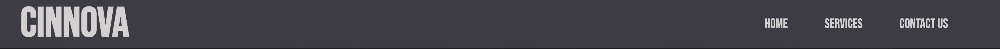

    - The navigation bar is responsive:
        * On tablets and larger: the navigation is on the right side.

        * On mobile devices: 
            - on the left side of the logo there is a hamburger menu.      
            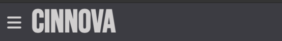
        
            - When the hamburger menu is clicked, there is dropdown menu with the links in the same order.
            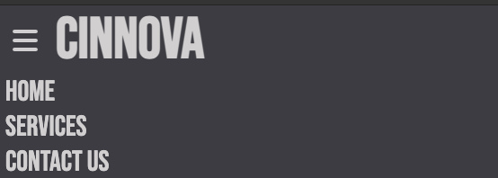

---

+ ### Home Page

    - Represent: 

        * Inspiring words about the company.
        * A quick peak of the services provided.

    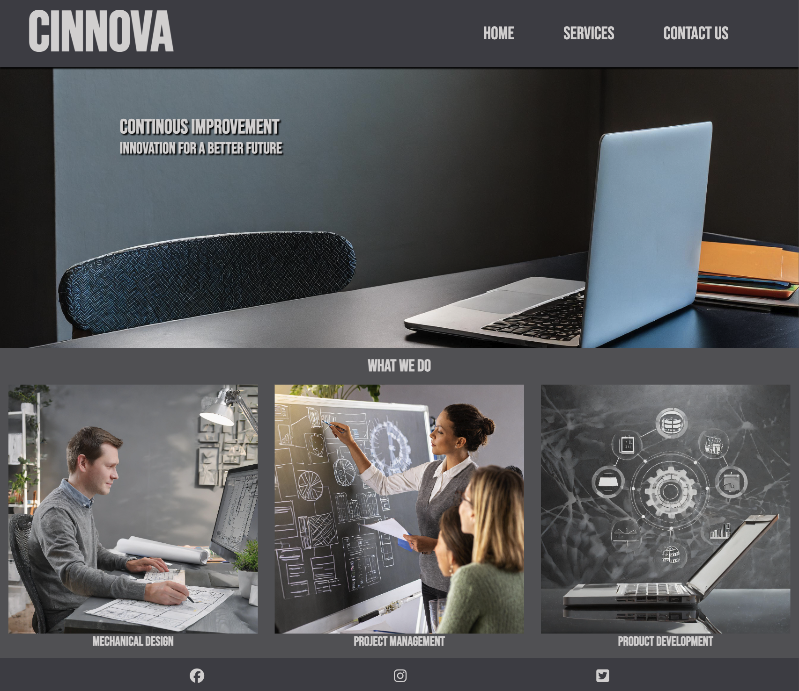

---

+ #### Hero Section

    - The hero section has a big background image.

    - The hero section contains some inspiring text.

    
    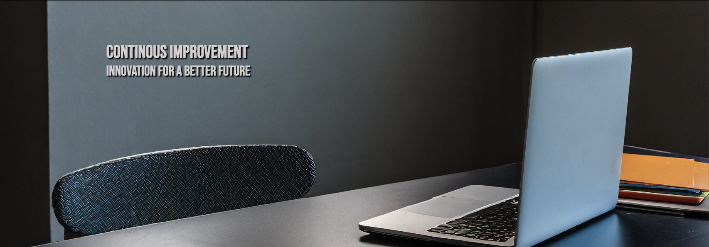

--- 

+ #### What we do Section

    - The what we do section has three images of the services provided.
    - Under each picture is a header for each service.
    - Attracts viewers to learn more about the services.

    
    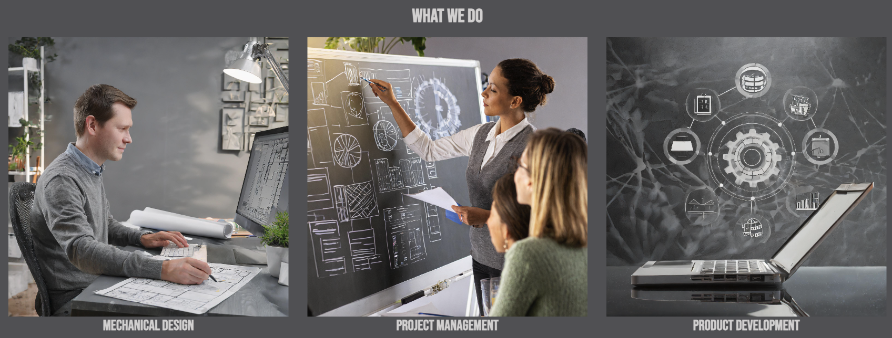

---

+ #### Footer

    - The footer contains social media links that open in a new tab.
    - The links in the footer change color when hovered.
​
    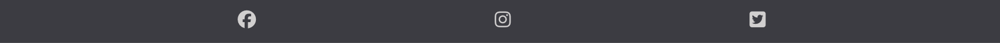
​
---
+ ### Services Page

    - The services page has the three images of the services provided.
    - The first and third image is placed on the right side. The second image is placed on the left side.
    - Each image contains some information about each service. 

    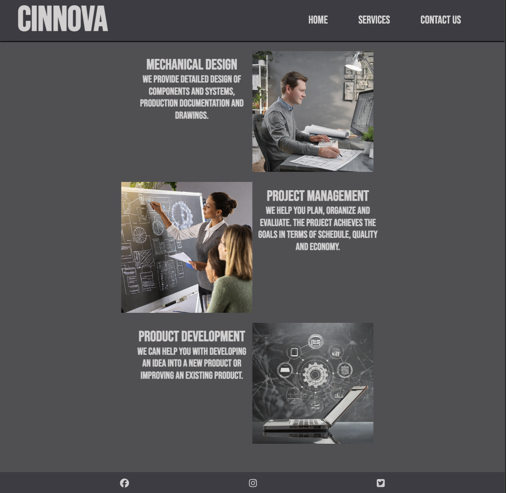
    
​
---
+ ### Contact us page

    - The contact us page has a box with address information.
    - The contact us page has a contact form:
        - You have to fill out your name, the name of the company and email-address.
        - All inputs are set to be required to be filled out.
    
    - When you press the submit button it leads to a response page.
​
    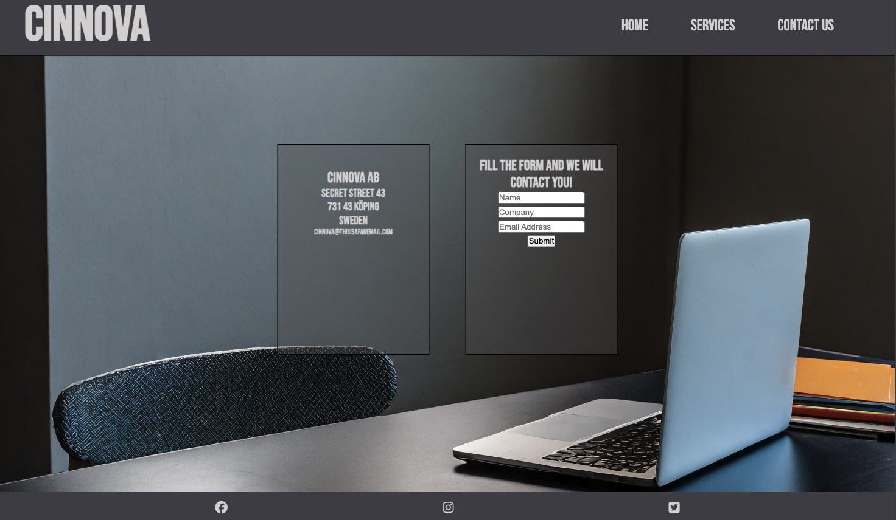

---
+ ### Response page

    - The submit button on the contact us page leads to the response page.
    - It contains a message that the company will contact you as soon as they can and that you will be returning to the homepage in 10 seconds.
    - It will automatically direct the user to the main page after 10 seconds.

    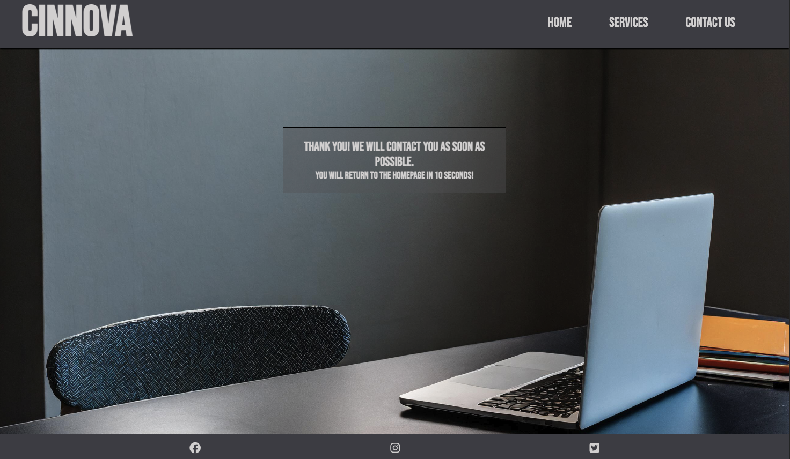

---
## Technologies Used

- [HTML](https://developer.mozilla.org/en-US/docs/Web/HTML) was used as the foundation of the site.
- [CSS](https://developer.mozilla.org/en-US/docs/Web/css) - was used to add the styles and layout of the site.
- [CSS Flexbox](https://developer.mozilla.org/en-US/docs/Learn/CSS/CSS_layout/Flexbox) - was used to arrange items on the pages.
- [Balsamiq](https://balsamiq.com/) was used to make wireframes for the website.
- [VSCode](https://code.visualstudio.com/) was used as the main tool to write and edit code.
- [Git](https://git-scm.com/) was used for the version control of the website.
- [GitHub](https://github.com/) was used to host the code of the website.
- [Adobe Firefly](https://adobe.com/products/firefly.html/) was used to generate all the images for the webpage.

---
## Design

### Color Scheme

- Dark grey color: rgb(90, 90, 94) was used for the header.

- A lighter shade of gray: rgb(68, 68, 76) was used as background color.

- The text on the page had a whiter color: rgb(215, 213, 213). It blends in well with the grey colors.

### Typography

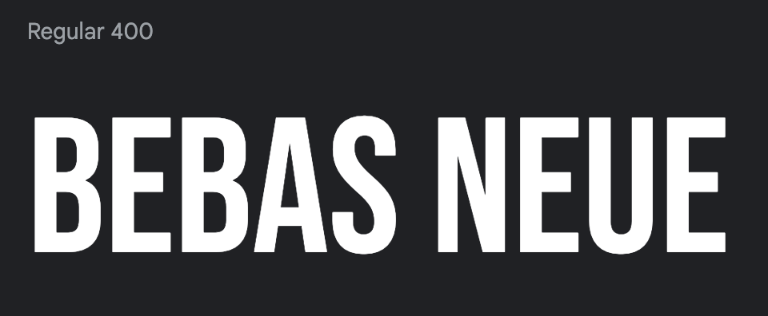

- Bebas Neue Google Font was used as the main font.

### Wireframes

#### Desktop

- [Home Page. Desktop Screen]()
- [Gallery Page. Desktop Screen]()
- [Contact Page. Desktop Screen]()
- [Response Page. Desktop Screen]()

---

## Testing

Please refer to the [TESTING.md](TESTING.md) file for all test-related documentation.

---

## Deployment

### Deployment to GitHub Pages

- The site was deployed to GitHub pages. The steps to deploy are as follows: 
  - In the [GitHub repository](https://github.com/ollebrask/cinnova/), navigate to the Settings tab 
  - From the source section drop-down menu, select the **Main** Branch, then click "Save".
  - The page will be automatically refreshed with a detailed ribbon display to indicate the successful deployment.

The live link can be found [here](https://ollebrask.github.io/cinnova/)

### Local Deployment

To make a local copy of this project, you can clone it.
In your IDE Terminal, type the following command to clone my repository:

- `git clone https://github.com/ollebrask/cinnova.git`

---

## Future improvements
- ???

---
## Credits

+ #### Content

    - Inspiration for the README file came from my mentor Iuliia Konovalova's Animal Shelter Project [Animal Shelter README](https://github.com/IuliiaKonovalova/animal_shelter/blob/main/README.md)
    - Inspiration for the hamburger menu came from the Code Institutes: Love Running Walkthrough Project.
    - Inspiration for the social media footer came from the Code Institutes: Love Running Walkthrough Project.

+ #### Media

    - All the images for the website were generated with [Adobe Firefly](https://adobe.com/products/firefly.html/).
    
---

## Acknowledgments

- [Iuliia Konovalova](https://github.com/IuliiaKonovalova) my mentor, thank you for your support with VS Code and feedback during the project.
- [Kevin Powell](https://www.youtube.com/user/KepowOb) for his flexbox tutorials.

- My friend Pontus Karlström, who recently started the Cinnova company and let me use his company as my first project.

[def]: documentation/header_mobile.png