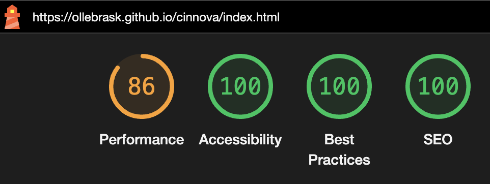

# TESTING

## Compatibility

In order to confirm the correct functionality, responsiveness, and appearance:

+ The website was tested on the following browsers: Chrome and Safari

    - Chrome:

    

    - Safari:

    

## Responsiveness

+ The website was checked by devtools implemented in Chrome.

+ The website was checked with [Responsive Viewer addon for Chrome](https://responsiveviewer.org/).

    - Index page

    

    - Services page:

    

    - Contact page:

    

    - Response page:

    

+ The functionality of the links in the website was checked as well by different users.

## Manual testing

| feature | action | expected result | tested | passed | comments |
| --- | --- | --- | --- | --- | --- |
| Navbar | | | | | |
| Home | Click on the "Home" link | The user is redirected to the main page | Yes | Yes | - |
| Services | Click on the "Services" link | The user is redirected to the services page | Yes | Yes | - |
| Contact us | Click on the "Contact" link | The user is redirected to the contact page | Yes | Yes | - |
| Footer | | | | | |
| Facebook icon in the footer | Click on the Facebook icon | The user is redirected to the Facebook page | Yes | Yes | - |
| Instagram icon in the footer | Click on the Instagram icon | The user is redirected to the Instagram page | Yes | Yes | - |
| Twitter icon in the footer | Click on the Twitter icon | The user is redirected to the Twitter page | Yes | Yes | - |
| Contact us page | | | | | |
| Name input | Enter the name | The name is entered | Yes | Yes | If user doesn't enter the name, the error message appears |
| Company input | Enter the company name | The company name is entered | Yes | Yes | If user doesn't enter the company name, the error message appears |
| Email input | Enter the email | The email is entered | Yes | Yes | If user doesn't enter the email, the error message appears. If user enters not valid email, the error message appears |
| "Submit" button | Click on the "Submit" button | The user is redirected to the response page | Yes | Yes | - |
| Response page | | | | | |
| Response message | The user will be automatically redirected to the home page after 10 seconds | The user is redirected to the home page | Yes | Yes | - |

---
## Validator testing
+ ### HTML
  #### Home Page
    - No errors or warnings were found when passing through the official W3C validator.

    
    
  #### Services Page
    - No errors or warnings were found when passing through the official W3C validator.

    

  #### Contact Page
    - No errors or warnings were found when passing through the official W3C validator.

    

  #### Response Page
    - No errors or warnings were found when passing through the official W3C validator.

    
    
+ ### CSS
  No errors or warnings were found when passing through the official W3C (Jigsaw) validator:
    

  
  
 

+ ## LightHouse report

    - Using lighthouse in devtools I confirmed that the website is performing well, accessible and colors and fonts chosen are readable.
    
  ### Home page

  

  ### Services page

  

  ### Contact page

  

  ### Response page

  

---
+ ### Bugs
    - I had some horizontal overflow on the Contact us page. I had forgot to create style for parent containers: width: 100%, display: flex etc.
    - When i tried to make underline for current pages in the navigation bar it didn't because of other code overwriting the style. I had to use an !important tag to make it work.
+ ### Unsolved bugs
    - None.
+ ### Mistakes
    - I added the images and started coding before optimizing them for a website.
    This gave the website a very low score in Performance in the lighthouse-report.
    Afterwards I changed the images to .webp, and that enhanced the result but I also need to resize the images.

---